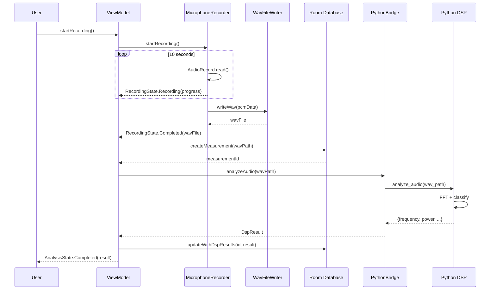

# TV Screen DSP - Android Application

> **Acoustic-based TV screen crack detection using on-device Python DSP**

## Overview

This Android application analyzes audio recordings to detect potential surface damage on TV screens through acoustic signature analysis. The app runs entirely on-device using embedded Python via Chaquopy—no backend, no API calls, full offline capability.

---

## Table of Contents

1. [Architecture](#architecture)
2. [Module Structure](#module-structure)
3. [Layer Responsibilities](#layer-responsibilities)
4. [Data Flow](#data-flow)
5. [Kotlin ↔ Python Bridge](#kotlin--python-bridge)
6. [Threading Model](#threading-model)
7. [Chaquopy Setup](#chaquopy-setup)
8. [Build & Run](#build--run)
9. [Demo Workflow](#demo-workflow)

---

## Architecture

```
┌─────────────────────────────────────────────────────────────────┐
│                        PRESENTATION LAYER                        │
│  ┌─────────────────┐  ┌─────────────────┐  ┌─────────────────┐ │
│  │ MeasurementScreen│  │   ResultScreen   │  │  HistoryScreen  │ │
│  └────────┬────────┘  └────────┬────────┘  └────────┬────────┘ │
│           │                    │                    │           │
│  ┌────────▼────────────────────▼────────────────────▼────────┐ │
│  │                  MeasurementViewModel                      │ │
│  │    ┌──────────────┐  ┌──────────────┐  ┌───────────────┐  │ │
│  │    │RecordingState│  │AnalysisState │  │ allMeasurements│  │ │
│  │    └──────────────┘  └──────────────┘  └───────────────┘  │ │
│  └────────┬─────────────────────┬────────────────────┬───────┘ │
└───────────┼─────────────────────┼────────────────────┼─────────┘
            │                     │                    │
┌───────────▼─────────────────────▼────────────────────▼─────────┐
│                         DOMAIN LAYER                            │
│  ┌──────────────────┐  ┌──────────────────┐                    │
│  │ MicrophoneRecorder│  │ PythonDspBridge  │                    │
│  │   (Audio Layer)   │  │   (DSP Layer)    │                    │
│  └────────┬─────────┘  └────────┬─────────┘                    │
└───────────┼─────────────────────┼──────────────────────────────┘
            │                     │
┌───────────▼─────────────────────▼──────────────────────────────┐
│                          DATA LAYER                             │
│  ┌──────────────────────────────────────────────────────────┐  │
│  │                 MeasurementRepository                     │  │
│  └──────────────────────────┬───────────────────────────────┘  │
│                             │                                   │
│  ┌──────────────────────────▼───────────────────────────────┐  │
│  │    Room Database        │        WAV Files               │  │
│  │  ┌──────────────────┐   │   ┌──────────────────────┐     │  │
│  │  │ MeasurementEntity│   │   │ /files/audio/*.wav   │     │  │
│  │  │ MeasurementDao   │   │   │ (Internal Storage)   │     │  │
│  │  │ AppDatabase      │   │   └──────────────────────┘     │  │
│  │  └──────────────────┘   │                                │  │
│  └──────────────────────────────────────────────────────────┘  │
└─────────────────────────────────────────────────────────────────┘
            │
┌───────────▼─────────────────────────────────────────────────────┐
│                       PYTHON LAYER (Chaquopy)                   │
│  ┌──────────────────────────────────────────────────────────┐  │
│  │                   dsp_analyzer.py                         │  │
│  │  ┌────────────┐ ┌────────────┐ ┌────────────┐            │  │
│  │  │ read_wav() │ │compute_fft()│ │classify()  │            │  │
│  │  └────────────┘ └────────────┘ └────────────┘            │  │
│  └──────────────────────────────────────────────────────────┘  │
│  Dependencies: numpy                                            │
└─────────────────────────────────────────────────────────────────┘
```

---

## Module Structure

```
app/
├── src/main/
│   ├── java/com/example/tvscreendsp/
│   │   ├── audio/
│   │   │   ├── AudioConfig.kt         # Recording constants
│   │   │   ├── RecordingState.kt      # Sealed class for states
│   │   │   ├── WavFileWriter.kt       # PCM → WAV conversion
│   │   │   ├── MicrophoneRecorder.kt  # Flow-based recorder
│   │   │   └── AudioRecordPitfalls.kt # Documentation
│   │   │
│   │   ├── data/
│   │   │   ├── local/
│   │   │   │   ├── MeasurementEntity.kt  # Room entity
│   │   │   │   ├── MeasurementDao.kt     # Data access object
│   │   │   │   └── AppDatabase.kt        # Database singleton
│   │   │   ├── model/
│   │   │   │   └── DspResult.kt          # DSP result data class
│   │   │   ├── repository/
│   │   │   │   └── MeasurementRepository.kt
│   │   │   └── RoomPitfalls.kt           # Documentation
│   │   │
│   │   ├── dsp/
│   │   │   ├── PythonDspBridge.kt     # Chaquopy bridge
│   │   │   └── ChaquopyPitfalls.kt    # Documentation
│   │   │
│   │   └── ui/
│   │       └── measurement/
│   │           └── MeasurementViewModel.kt
│   │
│   └── python/
│       └── dsp_analyzer.py            # Python DSP module
│
├── build.gradle.kts                   # Chaquopy config
└── AndroidManifest.xml                # RECORD_AUDIO permission
```

---

## Layer Responsibilities

| Layer | Responsibility | Key Classes |
|-------|---------------|-------------|
| **UI** | Display states, handle user input | `MeasurementScreen`, `MeasurementViewModel` |
| **Audio** | Record 10s PCM, save WAV | `MicrophoneRecorder`, `WavFileWriter` |
| **DSP** | FFT, power calc, classification | `PythonDspBridge`, `dsp_analyzer.py` |
| **Data** | Persist measurements, query history | `MeasurementRepository`, `AppDatabase` |
| **Python** | Numpy-based signal processing | `dsp_analyzer.py` |

---

## Data Flow

### Recording → Analysis → Storage



---

## Kotlin ↔ Python Bridge

### Data Flow Diagram

```
┌─────────────────────────────────────────────────────────────────┐
│                          KOTLIN SIDE                            │
│  ┌───────────────────────────────────────────────────────────┐ │
│  │  MeasurementViewModel                                      │ │
│  │  ┌─────────────────────────────────────────────────────┐  │ │
│  │  │ val wavPath: String = "/data/.../audio/rec_123.wav" │  │ │
│  │  └──────────────────────┬──────────────────────────────┘  │ │
│  └─────────────────────────┼─────────────────────────────────┘ │
│                            │                                    │
│  ┌─────────────────────────▼─────────────────────────────────┐ │
│  │  PythonDspBridge                                           │ │
│  │  ┌─────────────────────────────────────────────────────┐  │ │
│  │  │ dspModule.callAttr("analyze_audio", wavPath)        │  │ │
│  │  │         ↓                                            │  │ │
│  │  │ PyObject → DspResult conversion                      │  │ │
│  │  └─────────────────────────────────────────────────────┘  │ │
│  └─────────────────────────┬─────────────────────────────────┘ │
└────────────────────────────┼────────────────────────────────────┘
                             │
                    ┌────────▼────────┐
                    │   CHAQUOPY       │
                    │  (JNI Bridge)    │
                    └────────┬────────┘
                             │
┌────────────────────────────▼────────────────────────────────────┐
│                         PYTHON SIDE                              │
│  ┌───────────────────────────────────────────────────────────┐ │
│  │  dsp_analyzer.py                                           │ │
│  │  ┌─────────────────────────────────────────────────────┐  │ │
│  │  │ def analyze_audio(wav_path: str) -> dict:           │  │ │
│  │  │     samples, sr = read_wav(wav_path)                │  │ │
│  │  │     freq, mags, dom_freq = compute_fft(samples, sr) │  │ │
│  │  │     power_db = compute_power_db(samples)            │  │ │
│  │  │     tension = compute_surface_tension(freq, mags)   │  │ │
│  │  │     status, conf = classify_crack(...)              │  │ │
│  │  │     return {                                        │  │ │
│  │  │         "frequency": dom_freq,                      │  │ │
│  │  │         "power": power_db,                          │  │ │
│  │  │         "surface_tension": tension,                 │  │ │
│  │  │         "noise_status": status,                     │  │ │
│  │  │         "confidence": conf                          │  │ │
│  │  │     }                                               │  │ │
│  │  └─────────────────────────────────────────────────────┘  │ │
│  └───────────────────────────────────────────────────────────┘ │
└─────────────────────────────────────────────────────────────────┘
```

### Type Mapping

| Python Type | Kotlin Type | Conversion Method |
|-------------|-------------|-------------------|
| `float` | `Double` | `pyObject.toDouble()` |
| `str` | `String` | `pyObject.toString()` |
| `dict` | `Map<String, Any>` | `pyObject.asMap()` |
| `list` | `List<Any>` | `pyObject.asList()` |

---

## Threading Model

```
┌─────────────────────────────────────────────────────────────────┐
│                        MAIN THREAD                               │
│  ┌─────────────────────────────────────────────────────────┐    │
│  │ • UI rendering (Compose)                                 │    │
│  │ • StateFlow observation                                  │    │
│  │ • Python initialization (one-time)                       │    │
│  └─────────────────────────────────────────────────────────┘    │
└─────────────────────────────────────────────────────────────────┘
                              ↓
┌─────────────────────────────────────────────────────────────────┐
│                      Dispatchers.IO                              │
│  ┌─────────────────────────────────────────────────────────┐    │
│  │ • AudioRecord.read() - blocking I/O                      │    │
│  │ • WAV file writing                                       │    │
│  │ • Room database operations                               │    │
│  └─────────────────────────────────────────────────────────┘    │
└─────────────────────────────────────────────────────────────────┘
                              ↓
┌─────────────────────────────────────────────────────────────────┐
│                    Dispatchers.Default                           │
│  ┌─────────────────────────────────────────────────────────┐    │
│  │ • Python DSP analysis (CPU-intensive)                    │    │
│  │ • FFT computation                                        │    │
│  │ • Classification logic                                   │    │
│  └─────────────────────────────────────────────────────────┘    │
└─────────────────────────────────────────────────────────────────┘
```

---

## Chaquopy Setup

### libs.versions.toml
```toml
[versions]
chaquopy = "16.0.0"

[plugins]
chaquopy = { id = "com.chaquo.python", version.ref = "chaquopy" }
```

### app/build.gradle.kts
```kotlin
plugins {
    alias(libs.plugins.chaquopy)
}

android {
    defaultConfig {
        ndk {
            abiFilters += listOf("arm64-v8a", "armeabi-v7a", "x86_64", "x86")
        }
    }
    
    flavorDimensions += "pyVersion"
    productFlavors {
        create("py311") {
            dimension = "pyVersion"
        }
    }
}

chaquopy {
    defaultConfig {
        version = "3.11"
        pip {
            install("numpy")
        }
    }
}
```

### Python Source Location
```
app/src/main/python/dsp_analyzer.py
```

---

## Build & Run

### Prerequisites
- Android Studio Hedgehog or newer
- JDK 17+
- Android SDK 35

### Build Commands
```bash
# Debug build
./gradlew assembleDebug

# First build takes ~5 minutes (downloads Python + numpy)
# Subsequent builds are cached
```

### Required Permissions
```xml
<uses-permission android:name="android.permission.RECORD_AUDIO"/>
```

---

## Demo Workflow

```
┌─────────────────────────────────────────────────────────────────┐
│ 1. APP LAUNCH                                                   │
│    • Python interpreter initializes (~500ms)                    │
│    • Home screen displays                                       │
└─────────────────────────────────────────────────────────────────┘
                              ↓
┌─────────────────────────────────────────────────────────────────┐
│ 2. TAP "MEASURE NOISE"                                          │
│    • Permission check (first launch only)                       │
│    • Recording starts immediately                               │
└─────────────────────────────────────────────────────────────────┘
                              ↓
┌─────────────────────────────────────────────────────────────────┐
│ 3. RECORDING (10 seconds)                                       │
│    • Progress bar updates every second                          │
│    • Cancel button available                                    │
└─────────────────────────────────────────────────────────────────┘
                              ↓
┌─────────────────────────────────────────────────────────────────┐
│ 4. ANALYZING                                                    │
│    • "Analyzing..." indicator                                   │
│    • Python FFT runs on-device                                  │
│    • ~2-5 seconds                                               │
└─────────────────────────────────────────────────────────────────┘
                              ↓
┌─────────────────────────────────────────────────────────────────┐
│ 5. RESULT                                                       │
│    • Status: NORMAL / CRACK / NOISE                             │
│    • Confidence: 0-100%                                         │
│    • Frequency, Power, Surface Tension                          │
└─────────────────────────────────────────────────────────────────┘
                              ↓
┌─────────────────────────────────────────────────────────────────┐
│ 6. HISTORY                                                      │
│    • All measurements saved to Room DB                          │
│    • Viewable in history screen                                 │
│    • Works completely offline                                   │
└─────────────────────────────────────────────────────────────────┘
```

---

## Key Design Decisions

| Decision | Rationale |
|----------|-----------|
| **On-device Python** | Privacy, speed, offline capability |
| **Numpy only** | Smaller APK, faster builds than scipy |
| **Room DB** | Structured storage, reactive queries |
| **StateFlow** | Lifecycle-aware UI updates |
| **Mutex for Python** | Thread safety with Python GIL |
| **WAV not BLOB** | Store file path only, not raw audio |

---

## Future Enhancements

- [ ] TensorFlow Lite classifier (replace rule-based)
- [ ] USB/BLE audio input support
- [ ] Export measurements as CSV
- [ ] Cloud sync (optional)

---

## License

Proprietary - Internal Use Only
