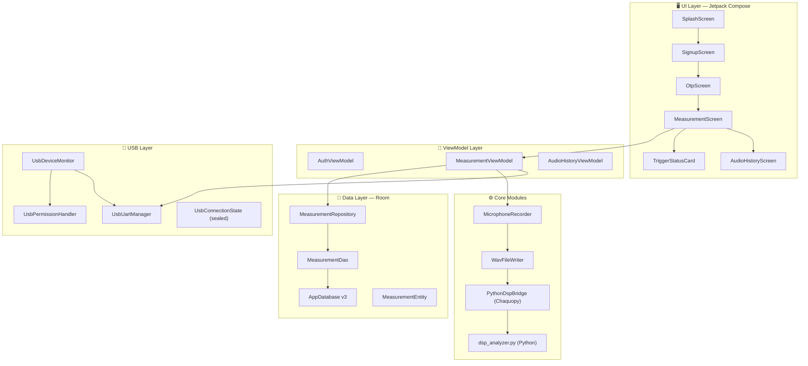
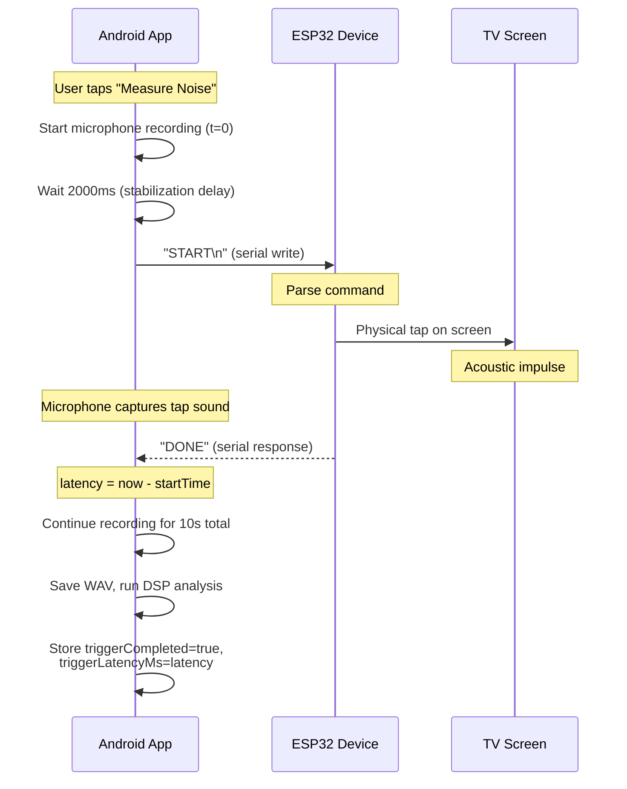
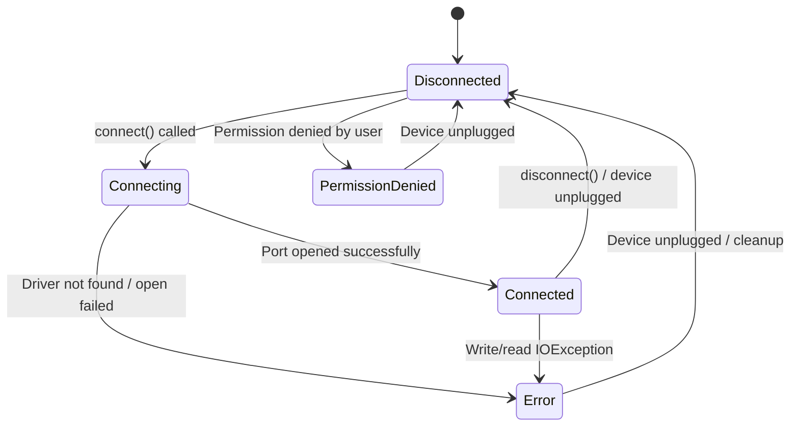
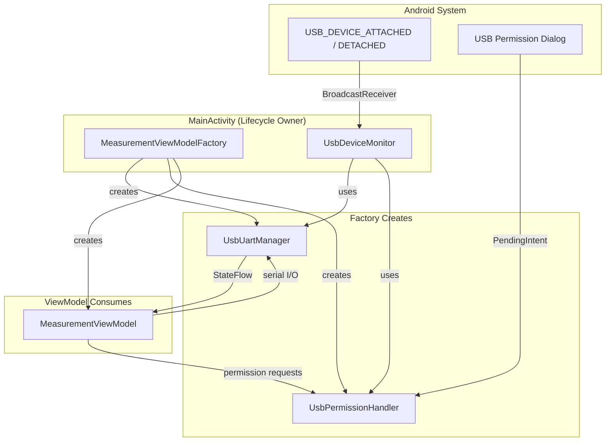
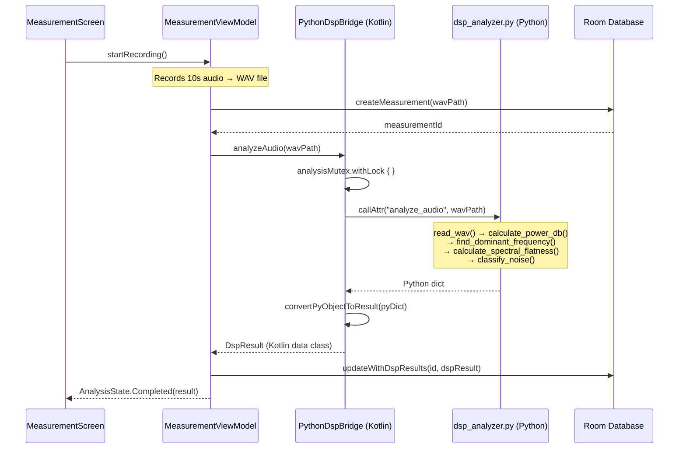
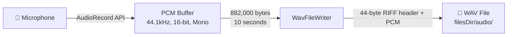
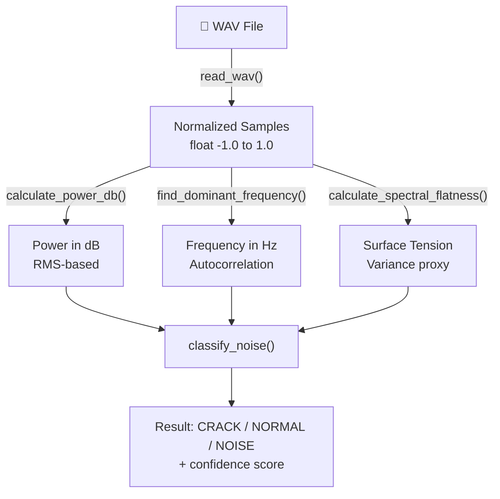
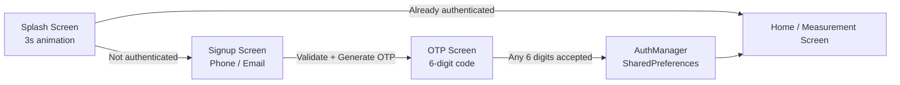

# TV Screen DSP — Android Application

> **Acoustic-based TV screen crack detection using on-device Python DSP + USB hardware trigger**

**Package:** `com.example.tvscreendsp`  
**Platform:** Android (minSdk 26, targetSdk 36)  
**Language:** Kotlin + Python 3.8 (Chaquopy)  
**License:** Proprietary — Internal Use Only

---

## Table of Contents

1. [Executive Summary](#1-executive-summary)
2. [Architecture Overview](#2-architecture-overview)
3. [Package Structure & File Inventory](#3-package-structure--file-inventory)
4. [Hardware Integration (USB-UART)](#4-hardware-integration-usb-uart)
5. [Handshake Protocol (START/DONE)](#5-handshake-protocol-startdone)
6. [USB Connection State Machine](#6-usb-connection-state-machine)
7. [USB Component Architecture](#7-usb-component-architecture)
8. [Kotlin ↔ Python Bridge (Chaquopy)](#8-kotlin--python-bridge-chaquopy)
9. [DSP Analysis Pipeline](#9-dsp-analysis-pipeline)
10. [Data Persistence Layer (Room)](#10-data-persistence-layer-room)
11. [Authentication Flow (Demo)](#11-authentication-flow-demo)
12. [Navigation Architecture](#12-navigation-architecture)
13. [End-to-End Data Flow](#13-end-to-end-data-flow)
14. [Threading Model](#14-threading-model)
15. [Technology Stack](#15-technology-stack)
16. [Build & Run](#16-build--run)
17. [Cautions & Known Pitfalls](#17-cautions--known-pitfalls)
18. [Key Design Decisions](#18-key-design-decisions)
19. [Project Status](#19-project-status)

---

## 1. Executive Summary

TV Screen DSP is a native Android application that uses **Digital Signal Processing (DSP)** to detect cracks in TV screens through audio analysis. An external **ESP32-based tapping device** physically taps the TV screen via a **USB-UART serial trigger**, while the phone's microphone records the resulting acoustic signature. The WAV file is then processed through a **Python DSP engine embedded inside the APK** (via Chaquopy), which classifies the signal as **CRACK**, **NORMAL**, or **NOISE** with a confidence score.

The system supports two modes:
- **USB Trigger Mode:** ESP32 executes a hardware handshake (START → physical tap → DONE), providing precise trigger timing metadata.
- **Manual Mode:** User physically taps the screen (fallback when no USB device is connected).

---

## 2. Architecture Overview



---

## 3. Package Structure & File Inventory

```
app/
├── src/main/
│   ├── java/com/example/tvscreendsp/
│   │   ├── MainActivity.kt                    # NavHost, Python + USB init
│   │   │
│   │   ├── audio/
│   │   │   ├── AudioConfig.kt                 # 44.1kHz, 16-bit, mono constants
│   │   │   ├── MicrophoneRecorder.kt          # Flow-based AudioRecord wrapper
│   │   │   ├── WavFileWriter.kt               # PCM → WAV (44-byte RIFF header)
│   │   │   ├── RecordingState.kt              # Sealed: Idle → Recording → Done
│   │   │   └── AudioRecordPitfalls.kt         # Developer docs (7 categories)
│   │   │
│   │   ├── usb/                               # ← NEW HARDWARE LAYER
│   │   │   ├── UsbUartManager.kt              # Serial I/O (connect, send, read)
│   │   │   ├── UsbDeviceMonitor.kt            # BroadcastReceiver: plug/unplug
│   │   │   ├── UsbPermissionHandler.kt        # Suspend-based permission dialog
│   │   │   ├── UsbConnectionState.kt          # Sealed class state machine
│   │   │   └── UsbIntegrationStrategy.kt      # Architecture documentation
│   │   │
│   │   ├── dsp/
│   │   │   ├── PythonDspBridge.kt             # Kotlin ↔ Python bridge (Chaquopy)
│   │   │   └── ChaquopyPitfalls.kt            # Developer docs (9 categories)
│   │   │
│   │   ├── data/
│   │   │   ├── local/
│   │   │   │   ├── AppDatabase.kt             # Room DB v3, migrations
│   │   │   │   ├── MeasurementEntity.kt       # Entity with trigger metadata
│   │   │   │   └── MeasurementDao.kt          # DAO with Flow-based queries
│   │   │   ├── model/
│   │   │   │   └── DspResult.kt               # DSP output data class
│   │   │   ├── repository/
│   │   │   │   └── MeasurementRepository.kt   # Repository pattern
│   │   │   └── RoomPitfalls.kt                # Developer docs
│   │   │
│   │   ├── auth/
│   │   │   └── AuthManager.kt                 # SharedPreferences demo auth
│   │   │
│   │   └── ui/
│   │       ├── splash/
│   │       │   └── SplashScreen.kt            # Animated splash (3s)
│   │       ├── auth/
│   │       │   ├── SignupScreen.kt             # Phone/email input
│   │       │   ├── OtpScreen.kt               # 6-digit OTP
│   │       │   └── AuthViewModel.kt           # Validation + local OTP
│   │       ├── measurement/
│   │       │   ├── MeasurementScreen.kt       # Record + analyze + results
│   │       │   ├── MeasurementViewModel.kt    # Orchestrator (555 lines)
│   │       │   └── MeasurementViewModelFactory.kt  # DI factory
│   │       ├── history/
│   │       │   ├── AudioHistoryScreen.kt      # History list with trigger status
│   │       │   └── AudioHistoryViewModel.kt   # History data management
│   │       └── theme/
│   │           └── TVScreenDSPTheme.kt        # Material 3 theme
│   │
│   ├── python/
│   │   └── dsp_analyzer.py                    # Pure Python DSP engine
│   │
│   ├── res/xml/
│   │   └── usb_device_filter.xml              # Supported USB-UART chip IDs
│   │
│   └── AndroidManifest.xml                    # Permissions + USB intent filters
│
├── build.gradle.kts                           # Chaquopy + USB serial config
└── gradle/libs.versions.toml                  # Version catalog
```

| Package | Files | Purpose |
|---------|-------|---------|
| **audio** | 5 | Microphone recording, WAV conversion, state management |
| **usb** | 5 | USB-UART serial communication, device monitoring, permissions |
| **dsp** | 2 | Python bridge, Chaquopy interop |
| **data** | 5 | Room database, entities, DAO, repository |
| **auth** | 1 | Demo authentication (SharedPreferences) |
| **ui** | 8+ | Compose screens, ViewModels, navigation |
| **python** | 1 | Pure Python DSP engine (no external deps) |

> **Total:** ~45+ source files across 8 Kotlin packages + 1 Python module

---

## 4. Hardware Integration (USB-UART)

### 4.1 Physical Setup

```
┌──────────────────────┐        OTG Cable          ┌──────────────────────┐
│                      │  ─────────────────────────▶│                      │
│   Android Phone      │     USB-UART (115200)      │   ESP32 Device       │
│                      │                            │   (Tapping Hardware) │
│  • Runs TV Screen    │  ◀─────────────────────────│                      │
│    DSP App           │      Serial Responses      │  • Receives "START"  │
│  • Records Audio     │                            │  • Physically taps   │
│  • Analyzes DSP      │                            │    the TV screen     │
│                      │                            │  • Responds "DONE"   │
└──────────────────────┘                            └──────────────────────┘
         │                                                     │
         │                   ┌──────────────────┐              │
         │                   │                  │              │
         └──────────────────▶│   TV Screen      │◀─────────────┘
           Records tap sound │   (Under Test)   │   Physical tap
                             │                  │
                             └──────────────────┘
```

### 4.2 Supported USB-UART Chips

The app auto-detects these common USB-to-serial converter chips (defined in `usb_device_filter.xml`):

| Chip | Vendor ID | Product ID | Hex VID:PID | Notes |
|------|-----------|------------|-------------|-------|
| **FTDI FT232R** | 1027 | 24577 | `0x0403:0x6001` | Professional grade |
| **Silicon Labs CP2102** | 4292 | 60000 | `0x10C4:0xEA60` | Common in ESP32 dev boards |
| **WCH CH340/CH341** | 6790 | 29987 | `0x1A86:0x7523` | Most common cheap adapter |
| **Prolific PL2303** | 1659 | 8963 | `0x067B:0x2303` | Legacy adapter |

### 4.3 Serial Port Configuration

| Parameter | Value |
|-----------|-------|
| Baud Rate | 115,200 |
| Data Bits | 8 |
| Stop Bits | 1 |
| Parity | None |
| Write Timeout | 1,000 ms |
| Read Poll Timeout | 100 ms per iteration |
| Read Buffer | 64 bytes |

### 4.4 How to Find Your Device's VID/PID

1. Plug in the USB device via OTG cable
2. Check Logcat for the `UsbDeviceMonitor` tag:
   ```
   D/UsbDeviceMonitor: USB ATTACHED: DeviceName (VID=0x1a86, PID=0x7523, path=/dev/bus/usb/...)
   ```
3. Add the VID/PID pair to `usb_device_filter.xml` if not listed
4. Or run: `adb shell lsusb`

> **⚠️ CAUTION:** For production, always specify exact VID/PID pairs. Omitting them matches ALL USB devices (development only).

---

## 5. Handshake Protocol (START/DONE)

### 5.1 Protocol Diagram



### 5.2 Command Reference

| Direction | Command | Format | Description |
|-----------|---------|--------|-------------|
| App → ESP32 | **TAP** | `"TAP\n"` | Direct trigger command (simple mode) |
| App → ESP32 | **START** | `"START\n"` | Initiate handshake measurement |
| ESP32 → App | **DONE** | `"DONE"` (substring) | Handshake acknowledgment |

### 5.3 Timing Parameters

| Parameter | Value | Purpose |
|-----------|-------|---------|
| Stabilization Delay | 2,000 ms | Wait for ESP32 to initialize after USB connection |
| Handshake Timeout | 5,000 ms | Max wait for "DONE" response |
| Recording Duration | 10,000 ms | Total audio capture time |

### 5.4 Graceful Degradation

The handshake is **never** required. If any step fails, the system silently falls back to **Manual Mode**:

```
USB not connected?           → MANUAL mode (user taps screen)
Permission denied?           → MANUAL mode
Serial port open fails?      → MANUAL mode
"START" write fails?         → MANUAL mode
"DONE" timeout (>5s)?        → MANUAL mode, triggerCompleted=false
IOException during read?     → MANUAL mode, port closed & cleaned up
```

> **⚠️ CAUTION:** The recording pipeline is NEVER interrupted by USB failures. Audio recording runs independently of the handshake.

---

## 6. USB Connection State Machine



### State Descriptions

| State | Description | UI Icon |
|-------|-------------|---------|
| `Disconnected` | No USB device connected or port closed | `usb_off` |
| `Connecting` | Port being opened and configured | `CircularProgressIndicator` |
| `Connected(deviceName)` | Serial port open, ready for I/O | `usb` (green) |
| `PermissionDenied` | User denied USB permission dialog | `usb` (yellow) |
| `Error(message)` | Connection or communication failure | `usb` (red) |

---

## 7. USB Component Architecture

### 7.1 Component Diagram



### 7.2 Component Responsibilities

| Component | File | Responsibility |
|-----------|------|----------------|
| `UsbUartManager` | `UsbUartManager.kt` | Serial I/O: connect, send commands, read responses |
| `UsbDeviceMonitor` | `UsbDeviceMonitor.kt` | BroadcastReceiver for USB plug/unplug events |
| `UsbPermissionHandler` | `UsbPermissionHandler.kt` | Suspend-based USB permission dialog |
| `UsbConnectionState` | `UsbConnectionState.kt` | Sealed class state machine |
| `MeasurementViewModelFactory` | `MeasurementViewModelFactory.kt` | Creates & shares USB instances |
| `UsbIntegrationStrategy` | `UsbIntegrationStrategy.kt` | Documentation-only object |

### 7.3 Auto-Connect Flow

When a USB device is physically plugged in:

```
USB Device Plugged In (OTG Cable)
     │
     ▼
AndroidManifest intent-filter matches VID/PID
     │
     ▼
UsbDeviceMonitor.handleAttach()
     │
     ├── Log device info (VID, PID, deviceName)
     ├── Invoke onDeviceAttached callback (optional)
     │
     ▼
UsbDeviceMonitor.autoConnectDevice()
     │
     ├── Check: usbManager.hasPermission(device)?
     │     │
     │     ├── YES → proceed to connect
     │     └── NO → UsbPermissionHandler.requestPermission()
     │              │
     │              ├── Shows system USB permission dialog
     │              ├── Suspends until user responds
     │              └── Returns true/false
     │
     ▼
UsbUartManager.connect()
     │
     ├── Probe for supported USB-serial drivers
     ├── Open device connection
     ├── Configure port: 115200 baud, 8N1
     └── Update connectionState → Connected(deviceName)
```

### 7.4 Memory Leak Prevention

| Concern | Guard |
|---------|-------|
| BroadcastReceiver leak | `unregister()` in `onDestroy()` |
| PermissionHandler receiver | Unregistered in `finally` block after each call |
| Serial port file descriptor | `closePortSafely()` on disconnect + `onDestroy` |
| Coroutine leak | `viewModelScope` auto-cancels on ViewModel clear |
| Activity reference leak | All USB classes use `applicationContext` |

> **⚠️ CAUTION:** The `UsbDeviceMonitor` MUST be unregistered in `Activity.onDestroy()`. Failure to do so causes a `BroadcastReceiver` leak that Android will log as an error.

---

## 8. Kotlin ↔ Python Bridge (Chaquopy)

### 8.1 Bridge Architecture



### 8.2 Initialization

```kotlin
// In MainActivity.onCreate() — MUST be main thread
PythonDspBridge.initialize(this)

// Internally:
fun initialize(context: Context) {
    if (!Python.isStarted()) {
        Python.start(AndroidPlatform(context))  // Boots Python runtime
    }
    dspModule = Python.getInstance().getModule("dsp_analyzer")  // Loads .py
}
```

> **⚠️ CAUTION:** Python initialization **must happen on the main thread**. Calling `Python.start()` from a background thread causes native crashes.

### 8.3 Data Type Mapping

| Python Type | Bridge Method | Kotlin Type |
|-------------|---------------|-------------|
| `dict` | `pyDict.asMap()` | `Map<PyObject, PyObject>` |
| `float` | `value.toDouble()` | `Double` |
| `str` | `value.toString()` | `String` |

> **⚠️ CAUTION:** Using `pyDict.get("key")` calls Python's `getattr()`, NOT `dict[key]`. The bridge correctly uses `asMap()` to iterate.

### 8.4 Thread Safety

| Concern | Solution |
|---------|----------|
| Python GIL conflicts | Kotlin `Mutex` serializes all calls |
| UI blocking during DSP | `Dispatchers.Default` for CPU work |
| Python init thread | `synchronized(this)` + double-checked lock |
| Memory leaks | `PyObject` references scoped to function calls |

---

## 9. DSP Analysis Pipeline

### 9.1 Audio Capture



| Parameter | Value |
|-----------|-------|
| Sample Rate | 44,100 Hz (CD quality) |
| Bit Depth | 16-bit PCM (~96 dB dynamic range) |
| Channels | Mono |
| Duration | 10 seconds |
| Raw Data Size | 882,000 bytes per recording |
| Storage | `filesDir/audio/measurement_YYYYMMDD_HHmmss.wav` |

### 9.2 DSP Processing Stages



#### Stage 1 — WAV Reading
- Opens file using Python `wave` module (stdlib)
- Reads 16-bit PCM samples via `struct.unpack()`
- Normalizes to `[-1.0, 1.0]` by dividing by 32,768

#### Stage 2 — Power Calculation
```
RMS = √(Σ(sample²) / N)
Power_dB = 20 × log₁₀(RMS)
```
Threshold: signals below **-50 dB** → classified as **NOISE** immediately.

#### Stage 3 — Frequency Detection
- Uses **autocorrelation** (not FFT) — pure Python, no NumPy needed
- Searches lags from 20 to 2000 samples across first 8192 samples
- `frequency = sample_rate / best_lag`

#### Stage 4 — Spectral Flatness
- Computes variance as proxy for spectral spread
- `flatness = min(1.0, √variance × 10)`, normalized to `[0, 1]`

#### Stage 5 — Classification

| Indicator | Threshold | Reasoning |
|-----------|-----------|-----------|
| High frequency | > 1,500 Hz | Cracks produce sharp transient sounds |
| High spectral flatness | > 0.6 | Crack noise has broad frequency content |
| Strong signal power | > -20 dB | Cracks are typically loud events |

**Decision logic:**
- **2+ indicators** → **CRACK** (confidence: 0.5 + indicators × 0.2, max 0.9)
- **1 indicator** → **NORMAL** (confidence: 0.7)
- **0 indicators** → **NORMAL** (confidence: 0.8)
- **Power < -40 dB** → **NOISE** (confidence: 0.6)

### 9.3 DSP Result Data Model

```kotlin
data class DspResult(
    val frequency: Double,       // Dominant frequency in Hz
    val power: Double,           // Signal power in dB (RMS)
    val surfaceTension: Double,  // Spectral flatness [0–1]
    val noiseStatus: String,     // "CRACK" | "NORMAL" | "NOISE"
    val confidence: Double       // Classification confidence [0–1]
)
```

---

## 10. Data Persistence Layer (Room)

### 10.1 Database Schema (Version 3)

| Column | Type | Nullable | Default | Description |
|--------|------|----------|---------|-------------|
| `id` | Long | No | auto | Auto-generated primary key |
| `wavFilePath` | String | No | — | Path to WAV file |
| `recordedAt` | Long | No | — | Unix timestamp (ms) |
| `customName` | String | Yes | null | User-assigned label (v2 migration) |
| `inputSource` | String | No | — | `"MICROPHONE"`, `"USB"`, or `"BLE"` |
| `frequency` | Double | Yes | null | Populated after DSP analysis |
| `power` | Double | Yes | null | Populated after DSP analysis |
| `surfaceTension` | Double | Yes | null | Populated after DSP analysis |
| `noiseStatus` | String | Yes | null | `"CRACK"`, `"NORMAL"`, `"NOISE"` |
| `confidence` | Double | Yes | null | Classification confidence [0–1] |
| `analysisCompletedAt` | Long | Yes | null | Timestamp of DSP completion |
| `triggerCompleted` | Boolean | No | `false` | ESP32 responded "DONE" (**v3**) |
| `triggerLatencyMs` | Long | Yes | null | START → DONE latency in ms (**v3**) |

### 10.2 Migration History

| Migration | Changes |
|-----------|---------|
| v1 → v2 | Added `customName` column |
| v2 → v3 | Added `triggerCompleted` (INTEGER NOT NULL DEFAULT 0) and `triggerLatencyMs` (INTEGER nullable) |

### 10.3 Repository Operations

| Method | Description |
|--------|-------------|
| `createMeasurement()` | Insert record after WAV saved (DSP fields null) |
| `updateWithDspResults()` | Populate DSP fields after analysis (does NOT overwrite trigger fields) |
| `deleteMeasurement()` | Removes DB record AND WAV file |
| `renameMeasurement()` | User-assigned custom name |
| `getAllMeasurements()` | Reactive `Flow` for auto-updating UI |

---

## 11. Authentication Flow (Demo)

The authentication is a **local-only demo flow** — no backend, no network calls.



- OTP is generated locally and logged to Logcat (demo purposes)
- Any 6-digit code is accepted as valid
- Auth state persisted in `SharedPreferences`
- Splash checks `AuthManager.isLoggedIn` on launch

---

## 12. Navigation Architecture

5 routes managed by Jetpack Navigation Compose:

| Route | Screen | Description |
|-------|--------|-------------|
| `splash` | SplashScreen | 3s animated splash → auto-navigate |
| `signup` | SignupScreen | Phone/email input with validation |
| `otp` | OtpScreen | 6-digit OTP verification |
| `home` | MeasurementScreen | Record + analyze + trigger status |
| `history` | AudioHistoryScreen | Browse recordings with trigger indicators |

---

## 13. End-to-End Data Flow

```
User taps "Measure Noise"
     │
     ▼
MeasurementViewModel.startRecording()
     │
     ├──▶ resolveUsbTriggerMode()
     │        ├── Check USB driver available?
     │        ├── Check USB permission?
     │        └── Return USB_UART or MANUAL
     │
     ▼
MicrophoneRecorder.startRecording() → Flow<RecordingState>
     │   (10 seconds, 44.1kHz, 16-bit mono)
     │   (emits progress: 0% → 100%)
     │
     ├──▶ [USB_UART mode only]
     │        ├── Wait 2000ms (stabilization)
     │        ├── sendStartCommand() → "START\n"
     │        ├── waitForDone(timeout=5000ms)
     │        │     ├── Read serial port in 100ms intervals
     │        │     ├── Accumulate buffer until "DONE" detected
     │        │     └── Return latency (ms) or timeout error
     │        └── Store HandshakeResult(completed, latencyMs)
     │
     ▼
WavFileWriter.writePcmToWav()
     │   (44-byte RIFF header + 882,000 bytes PCM)
     ▼
MeasurementRepository.createMeasurement()
     │   (Room insert, DSP fields = null,
     │    triggerCompleted + triggerLatencyMs populated)
     ▼
PythonDspBridge.analyzeAudio(wavPath)
     │   ┌──────────────────────────────────┐
     │   │  PYTHON RUNTIME (Chaquopy)       │
     │   │  dsp_analyzer.analyze_audio()    │
     │   │  1. read_wav → normalized floats │
     │   │  2. calculate_power_db → dB      │
     │   │  3. find_dominant_frequency → Hz  │
     │   │  4. calculate_spectral_flatness   │
     │   │  5. classify_noise → status       │
     │   └──────────────────────────────────┘
     ▼
convertPyObjectToResult() → DspResult
     │
     ▼
MeasurementRepository.updateWithDspResults()
     │   (Room update: DSP fields + analysisCompletedAt)
     ▼
UI updates:
  • ResultCard: Status, Confidence, Frequency, Power, Surface Tension
  • TriggerStatusCard: Handshake status (✅ OK / ❌ Failed / ⬜ Manual)
```

---

## 14. Threading Model

```
┌─────────────────────────────────────────────────────────────────┐
│                        MAIN THREAD                               │
│  • UI rendering (Jetpack Compose)                                │
│  • StateFlow observation                                         │
│  • Python initialization (one-time, MUST be main thread)         │
│  • BroadcastReceiver registration (UsbDeviceMonitor)             │
└─────────────────────────────────────────────────────────────────┘
                              ↓
┌─────────────────────────────────────────────────────────────────┐
│                      Dispatchers.IO                              │
│  • AudioRecord.read() — blocking I/O                             │
│  • WAV file writing                                              │
│  • Room database operations                                      │
│  • USB serial port: connect, write, read (UsbUartManager)        │
│  • USB permission registration (main thread dispatch internally) │
└─────────────────────────────────────────────────────────────────┘
                              ↓
┌─────────────────────────────────────────────────────────────────┐
│                    Dispatchers.Default                            │
│  • Python DSP analysis (CPU-intensive)                           │
│  • Autocorrelation frequency detection                           │
│  • Classification logic                                          │
└─────────────────────────────────────────────────────────────────┘
```

---

## 15. Technology Stack

| Layer | Technology | Version |
|-------|-----------|---------|
| Language (Android) | Kotlin | 2.0.21 |
| Language (DSP) | Python | 3.8 |
| Kotlin-Python Bridge | Chaquopy | 15.0.1 |
| USB Serial | usb-serial-for-android (mik3y) | 3.8.1 |
| UI Framework | Jetpack Compose + Material 3 | BOM 2026.01.01 |
| Database | Room (SQLite) | 2.8.4 |
| Navigation | Jetpack Navigation Compose | 2.9.7 |
| Permissions | Accompanist Permissions | 0.37.3 |
| Build System | Gradle (KTS) | AGP 8.13.2 |
| Symbol Processing | KSP | 2.0.21-1.0.27 |
| Compile/Target SDK | Android 36 | — |
| Min SDK | Android 26 (Oreo) | — |
| Java Target | JVM 17 | — |

---

## 16. Build & Run

### 16.1 Prerequisites

- Android Studio Ladybug or newer
- JDK 17+
- Android SDK 36
- USB OTG cable + ESP32 device (optional for hardware trigger)

### 16.2 Repository Setup

```bash
# Clone and add JitPack for USB serial library
# settings.gradle.kts already includes:
#   maven { url = uri("https://jitpack.io") }
#   maven { url = uri("https://chaquo.com/maven") }
```

### 16.3 Build Commands

```bash
# Debug build (first build downloads Python runtime, ~5 min)
./gradlew assemblePy38Debug

# Subsequent builds are cached and much faster
```

### 16.4 Required Permissions

```xml
<!-- Audio recording -->
<uses-permission android:name="android.permission.RECORD_AUDIO" />

<!-- USB Host mode (optional — app works without it) -->
<uses-feature android:name="android.hardware.usb.host" android:required="false" />
```

### 16.5 ABI Filtering

```kotlin
// Only arm64-v8a (phones) + x86_64 (emulator)
// Reduces build time from ~30 min to ~10 min
ndk { abiFilters += listOf("arm64-v8a", "x86_64") }
```

> **⚠️ CAUTION:** If you need to run on 32-bit devices, add `"armeabi-v7a"` and `"x86"` to the ABI filter. This significantly increases build time.

---

## 17. Cautions & Known Pitfalls

### 🔴 Critical

| # | Pitfall | Impact | Solution |
|---|---------|--------|----------|
| 1 | **Python.start() on background thread** | Native crash (SIGSEGV) | Always initialize in `MainActivity.onCreate()` on main thread |
| 2 | **BroadcastReceiver leak** | System error log, potential OOM | Call `UsbDeviceMonitor.unregister()` in `onDestroy()` |
| 3 | **Serial port not closed on disconnect** | File descriptor leak, device unusable | `closePortSafely()` nulls references and catches all exceptions |
| 4 | **Room migration missing** | App crash on upgrade (SQLite schema mismatch) | Always add `MIGRATION_X_Y` for new columns |
| 5 | **Concurrent Python calls** | GIL race condition, corrupted results | `Mutex` serializes all `callAttr()` invocations |

### 🟡 Important

| # | Pitfall | Impact | Solution |
|---|---------|--------|----------|
| 6 | **USB permission not persisted** | Re-prompt every app restart | Expected Android behavior; auto-request on attach |
| 7 | **ESP32 not ready after plug-in** | START command ignored | 2000ms stabilization delay before first handshake |
| 8 | **Chaquopy version mismatch** | Build failure at line 1 of `build.gradle.kts` | Use stable version (15.0.1), not bleeding edge |
| 9 | **PyObject.get() vs asMap()** | Wrong Python API called (getattr vs dict[key]) | Always use `asMap()` for dictionary access |
| 10 | **AudioRecord buffer underrun** | Silent gaps in recording | Buffer size calculated via `getMinBufferSize()` |

### 🟢 Informational

| # | Pitfall | Impact | Solution |
|---|---------|--------|----------|
| 11 | **OTG cable required** | No USB connection without OTG adapter | Use USB-C OTG or Micro-USB OTG depending on phone |
| 12 | **Device not auto-detected** | App doesn't launch on USB plug-in | Add VID/PID to `usb_device_filter.xml` |
| 13 | **WAV files accumulate** | Storage fills up over time | Delete via history screen or implement auto-cleanup |
| 14 | **Demo auth accepts any OTP** | Not suitable for production | Replace `AuthManager` with real backend |

### USB-Specific Safety Checks

```kotlin
// ALWAYS verify connection before serial I/O
if (_connectionState.value !is UsbConnectionState.Connected) {
    return Result.failure(IllegalStateException("Not connected"))
}

// ALWAYS use writeMutex for thread-safe serial access
writeMutex.withLock {
    port.write(data, WRITE_TIMEOUT_MS)
}

// ALWAYS handle IOException — device can unplug mid-operation
try {
    port.read(buffer, READ_POLL_TIMEOUT_MS)
} catch (e: IOException) {
    _connectionState.value = UsbConnectionState.Error("Read failed")
    closePortSafely()
}
```

---

## 18. Key Design Decisions

| Decision | Rationale |
|----------|-----------|
| **Pure Python stdlib** for DSP (no NumPy) | Avoids 10+ min build times and APK size explosion |
| **Autocorrelation** instead of FFT | No NumPy dependency; sufficient for dominant frequency |
| **Separate USB classes** (Manager/Monitor/Handler) | Single Responsibility: I/O, events, permissions isolated |
| **Result<T>** for all USB operations | Caller decides how to handle failures; no try-catch boilerplate |
| **Graceful degradation** to manual mode | USB issues never block the core recording/DSP pipeline |
| **applicationContext** for all USB classes | Prevents Activity leak on configuration change |
| **ViewModelFactory** for dependency injection | Shares USB instances between ViewModel and Activity without DI framework |
| **Post-analysis update pattern** | WAV saved immediately; DSP results populate later (fault-tolerant) |
| **Sealed classes** for state machines | Type-safe state representation (recording, connection, analysis) |
| **Flow-based DAO queries** | Reactive UI updates without manual refresh |
| **ABI filtering** (arm64-v8a + x86_64 only) | Reduces build time from ~30 min to ~10 min |
| **Trigger metadata in Room** | Enables querying historical handshake success rates |
| **singleTop launch mode** | Prevents duplicate Activity instances on USB re-plug |

---

## 19. Project Status

### ✅ Completed Features

- [x] Audio recording pipeline (10s microphone capture → WAV)
- [x] Python DSP engine with pure stdlib (no NumPy/SciPy)
- [x] Chaquopy Kotlin-Python bridge with thread safety
- [x] Room database with measurement history (v3)
- [x] USB-UART serial communication (connect, send, read)
- [x] USB device auto-detection and auto-connect
- [x] USB permission handling (suspend-based dialog)
- [x] Hardware handshake protocol (START/DONE with latency)
- [x] Trigger metadata persistence (triggerCompleted, triggerLatencyMs)
- [x] TriggerStatusCard UI (success/failure/manual states)
- [x] Trigger status indicators in history screen
- [x] Graceful degradation (USB → Manual fallback)
- [x] Results UI: frequency, power, surface tension, status, confidence
- [x] Audio history screen with playback, rename, and delete
- [x] Splash screen with professional animations
- [x] Demo authentication flow (phone/email + OTP)
- [x] Navigation architecture (5 screens)
- [x] Runtime permission handling (RECORD_AUDIO)
- [x] DB migrations (v1 → v2 → v3)
- [x] Developer reference docs (AudioRecordPitfalls, ChaquopyPitfalls, RoomPitfalls)
- [x] USB device filter XML (FTDI, CP210x, CH340, PL2303)

### 🔲 Planned / Future

- [ ] Real backend authentication (currently demo-only)
- [ ] ML-based crack classification (TensorFlow Lite, replace rule-based)
- [ ] NumPy integration for FFT-based frequency detection
- [ ] BLE audio input support
- [ ] Export measurements as CSV
- [ ] Cloud sync (optional)
- [ ] Auto-cleanup of old WAV files

---

## License

Proprietary — Internal Use Only
